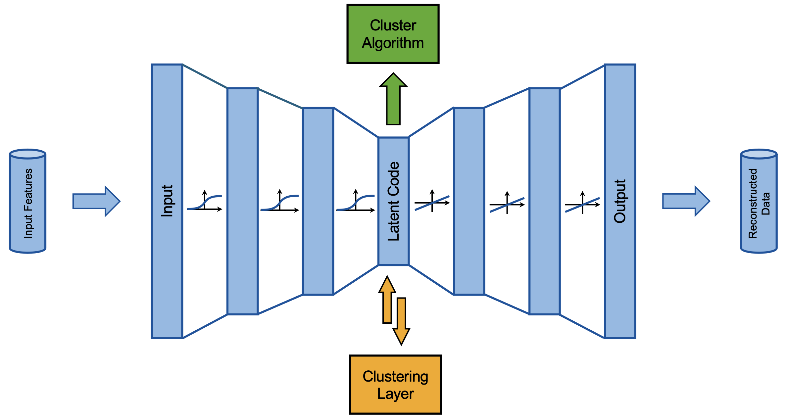

# Deep Auto-Encoder (AE) based Clustering
This repository demonstrates a flexible framework allowing for **separated- and embedded-AE-clustering**, hence allowing
for two different analysis pathways and given many free parameters being amenable to various problems. It includes 
**pre-processing**, **clustering**, **visualization** and **validation methods**.

## 1. What is embedded- and separated-AE-clustering?
Both approaches leverage a **deep AE network** to create a sparse, latent representation of the input data.
As such, the *curse of dimensionality's* (as it's often referred to) impact is mitigated. Further, subsequently applied
cluster algorithms profit from *uncorrelated and significant* input features, that are thereby favoured.

The categorisation is based on the distinct relation of cluster algorithm and AE layers. In
- **separated AE clustering** the AE and cluster algorithm are trained *separately* with the AE therefore serving as a pre-processing measure
- **embedded AE clustering** the AE and cluster layer are trained *simultaneously*, allowing for joint optimization of clustering and latent representation

The following image visualizes the different approaches. The *green* one-way arrow on top refers to the *separated*
approach, the *orange* two-way connection at the bottom denotes the *embedded* approach.

## 2. Repository Structure
- *src/*: source code directory containing classes and methods
- *notebooks/*: jupyter notebooks demonstrating the workflow on an example dataset
- *data/*: input data and saved clustering models
- *output/*: visualizations and model training logs
- *literature/*: relevant paper(s) explaining the theoretical underpinning 
- *images/*: illustrations for markdown cells and read-me

## 3. How to Use
### 3.1. Required Modules
Please see the required module list in the *environment.yml* file of the repository.

The recommended way to install all modules with conda is calling 
`conda env create -f environment.yml`
in terminal in the project directory.

### 3.2. Recommendations
Usage is demonstrated in the notebook, and it is advised to follow such procedure when implementing.
The utilized classes are **Preprocessor** and **DECModel** from *src/pipeline/clustering.py*. The steps are as follows:

1. initialise **preprocessor instance**: import and standardize data, remove outliers, detect correlations with PCA, visualize features
2. initialise **DECModel instance** from parameters or .keras file
3. **pretrain AE** independent of clustering layer
4. **initialise cluster weights** with k-means algorithm (separated clustering would be finished here)
5. **train AE and cluster layer** jointly (embedded clustering is finished here)
6. **evaluate training** with log file and visualizations

## 4. Other Important Information
### 4.1. Authors and Acknowledgment
Paul Rüsing - pr@paulruesing.de - single and main contributor

I acknowledge the inspiration drawn from https://arxiv.org/pdf/1802.01059, which is also present in the *literature/* 
directory. 

### 4.2. License
The project is licensed under the MIT license. To view a copy of this license, see [LICENSE](https://github.com/paulruesing/lrp-xai-pytorch?tab=MIT-1-ov-file).
